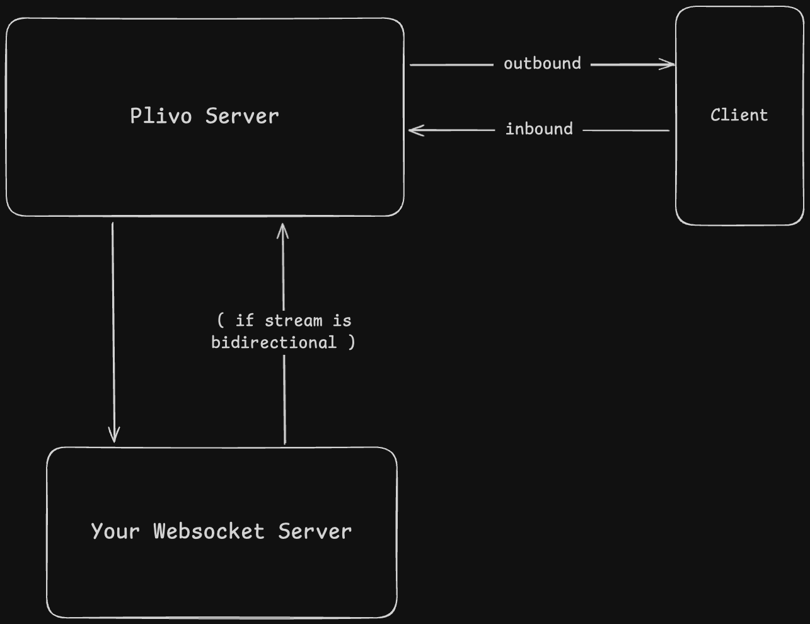

# Plivo Streaming Python SDK

A Python SDK for handling Plivo streaming with WebSocket support. Supports both FastAPI and the websockets library.

## Features

- **FastAPI Integration**: Native support for FastAPI WebSocket connections
- **WebSockets Library**: Support for the standard websockets library
- **Event-Driven**: Register callbacks/hooks for different events
- **Easy Media Handling**: Simple methods to send and receive media
- **Type-Safe**: Full type hints and Pydantic models for better IDE support
- **Modular Design**: Built to support multiple frameworks

## Installation

```bash
pip install plivo-streaming-python
```

For development (includes uvicorn for running examples):

```bash
pip install plivo-streaming-python[dev]
```

## Quick Start

### FastAPI Example

```python
from fastapi import FastAPI, WebSocket
from plivo_streaming import PlivoFastAPIStreamingHandler

app = FastAPI()

@app.websocket("/stream")
async def websocket_endpoint(websocket: WebSocket):
    handler = PlivoFastAPIStreamingHandler(websocket)
    
    @handler.on_connected
    async def on_connect():
        print("Client connected!")
    
    @handler.on_media
    async def on_media(data):
        media = data.get("media", {})
        payload = media.get("payload")
        # Process audio data here
        print(f"Received {len(payload)} bytes")
    
    @handler.on_disconnected
    async def on_disconnect():
        print("Client disconnected!")
    
    await handler.start()
```

### WebSockets Library Example

```python
import asyncio
import websockets
from plivo_streaming import PlivoWebsocketStreamingHandler

async def create_handler(websocket):
    handler = PlivoWebsocketStreamingHandler()
    
    @handler.on_connected
    async def on_connect():
        print("Client connected!")
    
    @handler.on_media
    async def on_media(data):
        payload = data.media.payload
        # Process audio data here
        print(f"Received {len(payload)} bytes")
    
    @handler.on_disconnected
    async def on_disconnect():
        print("Client disconnected!")
    
    await handler.handle(websocket)

async def main():
    async with websockets.serve(create_handler, "0.0.0.0", 8000):
        await asyncio.Future()  # run forever

if __name__ == "__main__":
    asyncio.run(main())
```

## Architecture



The SDK acts as a bridge between Plivo's server and your application, handling bidirectional audio streaming.

## API Reference

### PlivoFastAPIStreamingHandler

Main class for handling FastAPI WebSocket connections.

#### Initialization

```python
handler = PlivoFastAPIStreamingHandler(websocket)
```

#### Event Hooks

Register callbacks using decorators:

**`@handler.on_connected`**  
Called when WebSocket connection is established.

```python
@handler.on_connected
async def on_connect():
    print("Connected!")
```

**`@handler.on_disconnected`**  
Called when WebSocket connection is closed.

```python
@handler.on_disconnected
async def on_disconnect():
    print("Disconnected!")
```

**`@handler.on_media`**  
Called when media (audio) data is received.

```python
@handler.on_media
async def on_media(data):
    media = data.get("media", {})
    payload = media.get("payload")  # Base64 encoded audio
```

**`@handler.on_event(event_type)`**  
Called for specific Plivo event types.

```python
@handler.on_event("start")
async def on_start(event):
    print(f"Stream started: {event.data}")
```

**`@handler.on_error`**  
Called when an error occurs.

```python
@handler.on_error
async def on_error(error):
    print(f"Error: {error}")
```

#### Sending Methods

**`send_media(media_data)`**  
Send media data through the WebSocket.

```python
await handler.send_media(audio_base64_data)
```

**`send_checkpoint(checkpoint_name)`**  
Send a checkpoint  event to track message processing.

```python
await handler.send_checkpoint("processing_complete")
```

**`send_clear_audio()`**  
Clear the audio buffer on the stream.

```python
await handler.send_clear_audio()
```

**`send_json(data)`**  
Send arbitrary JSON data.

```python
await handler.send_json({"event": "custom", "data": "value"})
```

**`send_text(message)`**  
Send text message.

```python
await handler.send_text("Hello")
```

#### Lifecycle Methods

**`start()`**  
Start the WebSocket listener loop. This should be awaited in your endpoint.

```python
await handler.start()
```

**`stop()`**  
Stop the WebSocket listener and close the connection.

```python
await handler.stop()
```

### PlivoWebsocketStreamingHandler

Main class for handling plain WebSocket connections using the websockets library.

#### Initialization

```python
handler = PlivoWebsocketStreamingHandler()
```

#### Event Hooks

Same decorator-based event hooks as PlivoFastAPIStreamingHandler:
- `@handler.on_connected`
- `@handler.on_disconnected`
- `@handler.on_media`
- `@handler.on_event(event_type)`
- `@handler.on_error`

#### Sending Methods

Same methods as PlivoFastAPIStreamingHandler:
- `send_media(media_data)`
- `send_checkpoint(checkpoint_name)`
- `send_clear_audio()`
- `send_json(data)`
- `send_text(message)`

#### Lifecycle Methods

**`handle(websocket)`**  
Handle a WebSocket connection. This should be called from your websockets.serve handler.

```python
async def connection_handler(websocket):
    await handler.handle(websocket)
```

**`stop()`**  
Stop the WebSocket listener and close the connection.

```python
await handler.stop()
```

## Event Types

The SDK recognizes these Plivo event types:

- `connected` - WebSocket connection established
- `disconnected` - WebSocket connection closed
- `media` - Audio data received
- `start` - Stream started
- `error` - Error occurred
- `playedStream` - Audio events buffered before the Checkpoint were successfully played out to the end user
- `clearedAudio` - Cleared all buffered media events
- `dtmf` - Sent when someone presses a touch-tone number key in the inbound stream

## Code Architecture

```
plivo_streaming/
├── __init__.py           # Package exports
├── base.py               # Base handler with shared logic
├── types.py              # Pydantic models and type definitions
├── fastapi/
│   ├── __init__.py
│   └── streaming.py      # FastAPI WebSocket handler
└── websockets/
    ├── __init__.py
    └── streaming.py      # Plain WebSocket handler
```

## Development

```bash
# Install in development mode
pip install -e ".[dev]"

# Run FastAPI example
python examples/fastapi_example.py

# Run WebSockets example
python examples/websockets_example.py
```

## Roadmap

- [x] FastAPI support
- [x] WebSockets library support
- [x] Pydantic models for type safety
- [ ] Support for chunking and re-sampling